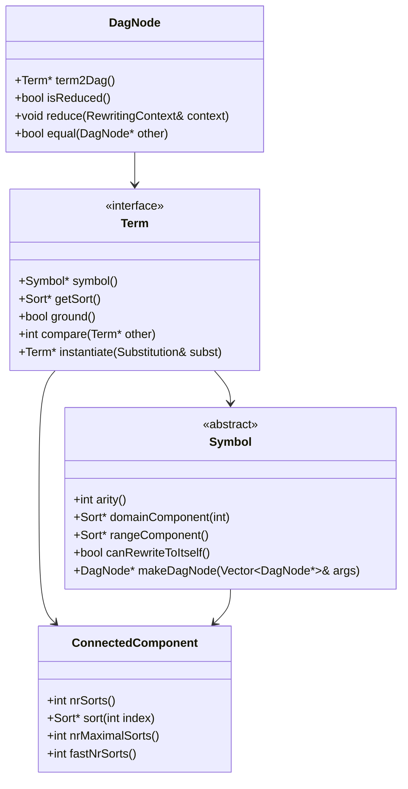
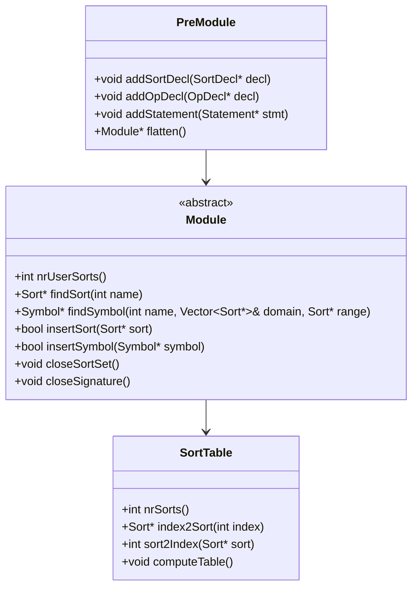
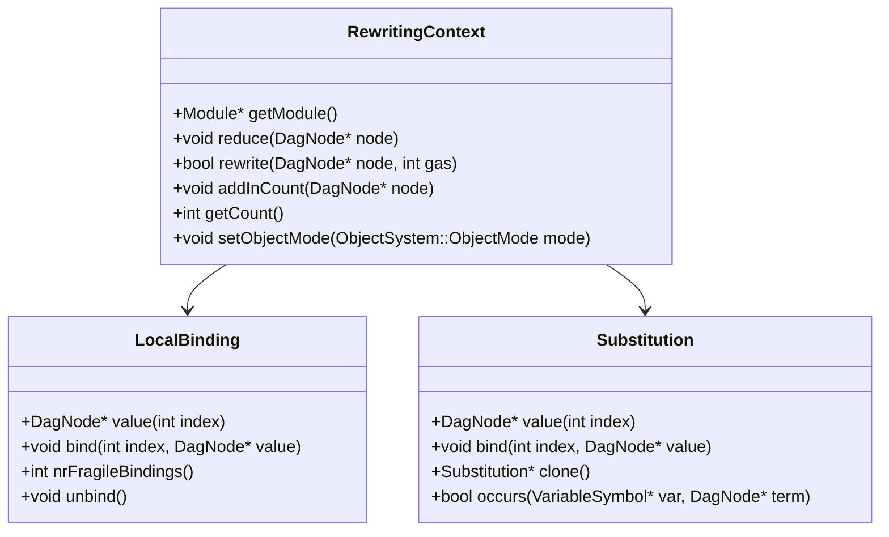
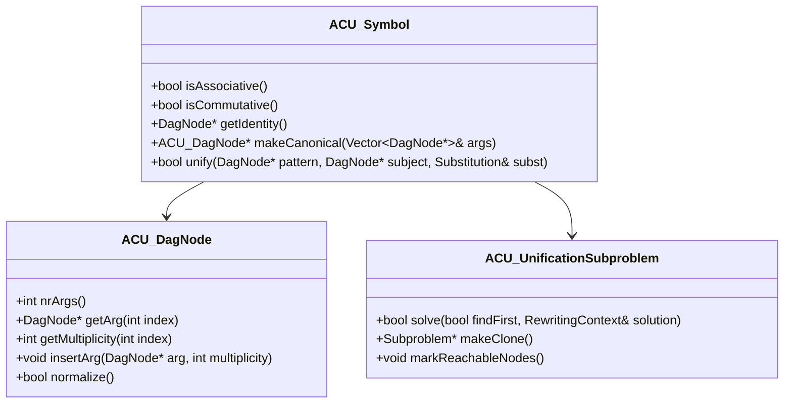
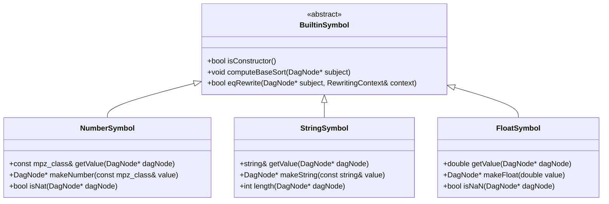
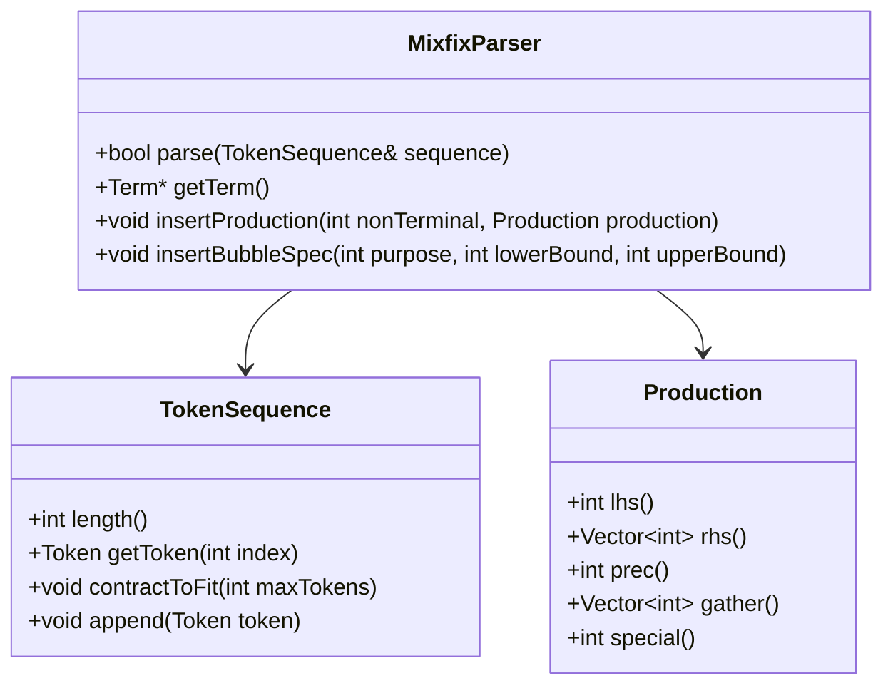
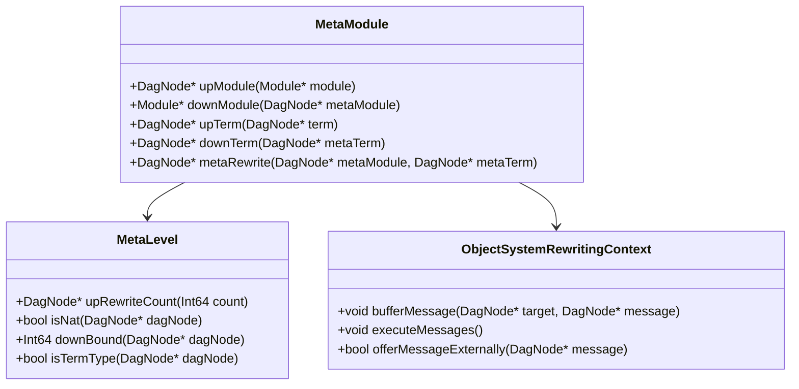
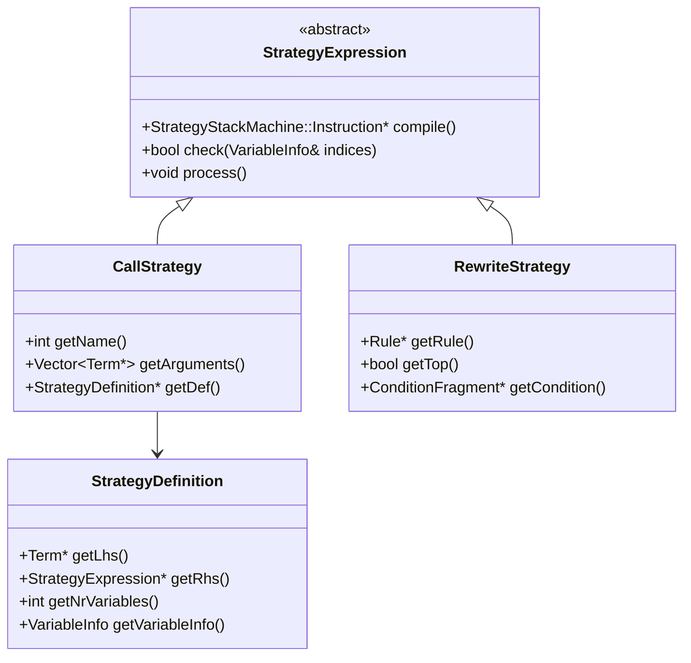
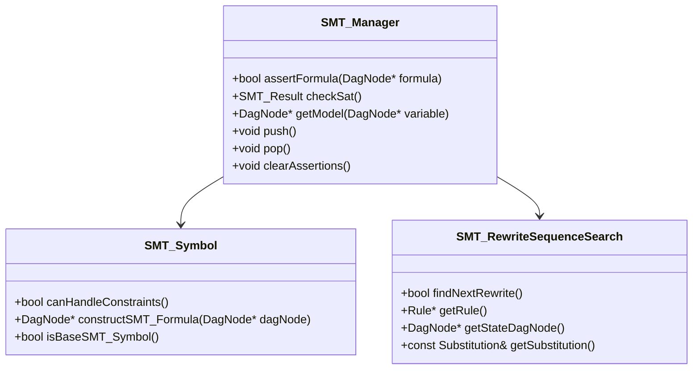
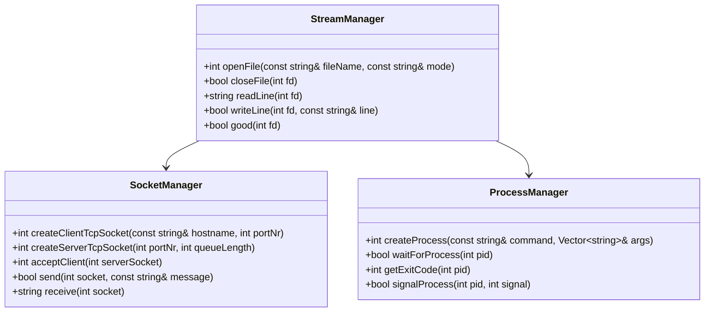

# Maude API and Interfaces Documentation

## Overview

This document describes the key APIs and interfaces in the Maude system, focusing on the programmatic interfaces between major components and extension points for developers.

## Core Interfaces

### Term Interface
The fundamental abstraction for all terms in Maude.



### Module Interface
Represents a Maude module containing sorts, operators, and statements.



### Rewriting Context Interface
Manages the execution context for rewriting operations.



## Theory-Specific Interfaces

### ACU Theory Interface
Associative-Commutative-Unity theory implementation.



### Built-in Type Interfaces
Interfaces for built-in data types.



## Parser and Mixfix Interfaces

### Parser Interface
Core parsing functionality.



## Meta-Level Interface
Reflection and meta-programming capabilities.



## Strategy Language Interface

### Strategy Definition Interface
Programming with strategies.



## SMT Interface
Integration with SMT solvers.



## I/O and External Interface

### I/O Operations Interface
File and network operations.



## Extension Points

### Adding New Built-in Types

To add a new built-in type:

1. **Inherit from BuiltinSymbol**:
```cpp
class MyTypeSymbol : public BuiltinSymbol {
    bool eqRewrite(DagNode* subject, RewritingContext& context);
    void computeBaseSort(DagNode* subject);
    // ... implement required methods
};
```

2. **Create corresponding DagNode class**:
```cpp  
class MyTypeDagNode : public DagNode {
    MyTypeValue value;
    // ... implement storage and operations
};
```

3. **Register with module system**:
```cpp
module->insertSymbol(new MyTypeSymbol(/* parameters */));
```

### Adding New Theories

To implement a new algebraic theory:

1. **Create theory-specific Symbol class**:
```cpp
class MyTheorySymbol : public Symbol {
    bool unify(DagNode* pattern, DagNode* subject, Substitution& subst);
    // ... implement theory-specific algorithms  
};
```

2. **Implement specialized DagNode**:
```cpp
class MyTheoryDagNode : public DagNode {
    // ... theory-specific representation
};
```

3. **Add unification algorithms**:
```cpp
class MyTheoryUnificationSubproblem : public UnificationSubproblem {
    bool solve(bool findFirst, RewritingContext& solution);
};
```

### Extending the Meta-Level

Add new meta-level operations:

1. **Extend MetaModule**:
```cpp
DagNode* MetaModule::myNewMetaOperation(DagNode* args) {
    // ... implement meta-operation
}
```

2. **Register operation**:
```cpp
insertEqRewrite(myMetaOp, &MetaModule::myNewMetaOperation);
```

## Thread Safety and Concurrency

**Current Status**: The Maude system is **not thread-safe**. Key considerations:

- **Single-threaded Design**: All operations assume single-threaded execution
- **Global State**: Many components maintain global state
- **Memory Management**: Hash consing and garbage collection are not thread-safe
- **Future Work**: Thread-safety would require significant architectural changes

## Performance Considerations

### Critical Paths
- **Term Construction**: Hash consing for structural sharing
- **Pattern Matching**: Optimized for common cases  
- **Rewriting**: Memoization and incremental evaluation
- **Unification**: Theory-specific optimizations

### Memory Usage
- **Term Sharing**: Aggressive structural sharing reduces memory
- **Garbage Collection**: Reference counting with cycle detection
- **Cache Management**: LRU policies for memoization caches

### Optimization Guidelines
1. **Minimize Term Construction**: Reuse existing terms when possible
2. **Leverage Memoization**: Cache expensive computations  
3. **Choose Appropriate Theories**: Select most specific theory for performance
4. **Batch Operations**: Group related operations to improve locality

---

This API documentation provides the foundation for understanding and extending the Maude system architecture.