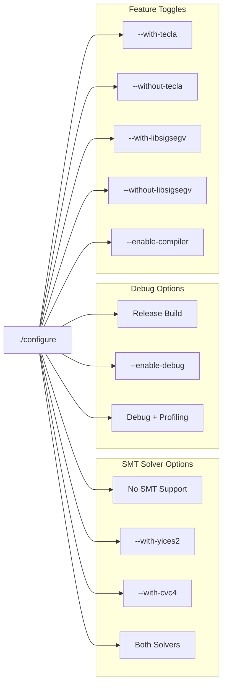
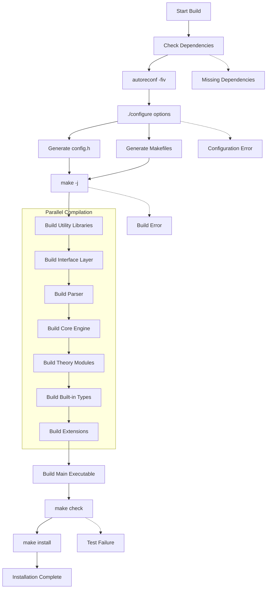
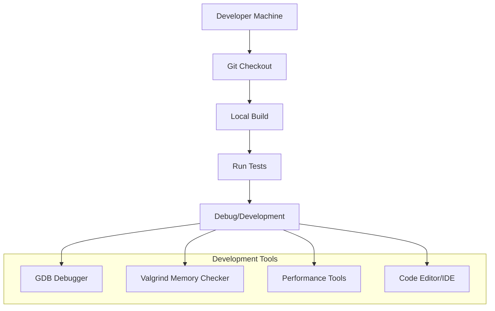
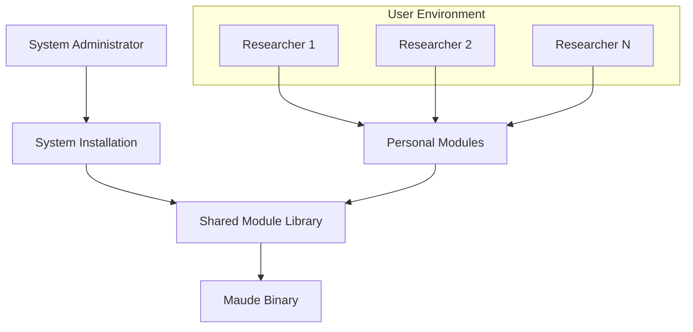
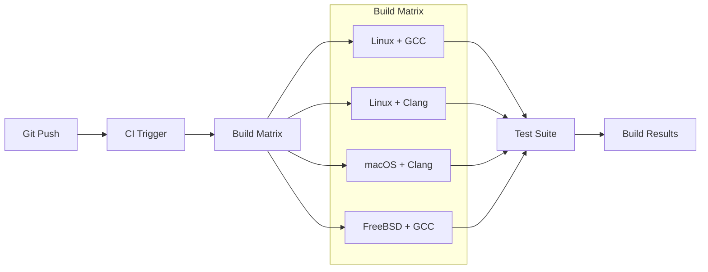

# Maude Deployment Architecture

## Overview

This document describes the deployment architecture, installation procedures, and runtime environment for the Maude system. It covers build configuration, dependency management, installation layouts, and operational considerations.

## System Requirements

### Hardware Requirements
- **Minimum RAM**: 512 MB (1 GB+ recommended for large computations)
- **Disk Space**: 100 MB for base installation, additional space for user modules
- **Architecture**: x86, x86_64, ARM64, SPARC, Alpha (tested platforms)

### Operating System Support
- **Primary**: Linux distributions (Ubuntu, Debian, CentOS, Fedora)
- **Secondary**: macOS, FreeBSD, Solaris
- **Compiler**: GCC 4.8+ or Clang 3.3+ with C++11 support

## Dependency Architecture

```mermaid
graph TB
    subgraph "Core Dependencies (Required)"
        GCC[GCC/Clang C++ Compiler]
        BISON[GNU Bison Parser Generator]
        FLEX[Flex Lexical Analyzer]
        GMP[GNU Multiple Precision Library]
        BUDDY[BuDDy BDD Library]
        AUTOTOOLS[GNU Autotools]
    end
    
    subgraph "System Libraries (Required)"
        LIBSIGSEGV[libsigsegv Signal Handling]
        TECLA[Tecla Command Line Editor]
        LIBC[Standard C Library]
        LIBM[Math Library]
        LIBRT[POSIX Realtime Library]
    end
    
    subgraph "Optional Dependencies"
        YICES2[Yices2 SMT Solver]
        CVC4[CVC4 SMT Solver]
        NCURSES[NCurses Terminal Library]
        TINFO[Terminal Info Library]
    end
    
    subgraph "Build Tools"
        AUTOMAKE[GNU Automake]
        AUTOCONF[GNU Autoconf]
        M4[GNU M4 Macro Processor]
        MAKE[GNU Make]
        RANLIB[Archive Index Generator]
    end
    
    MAUDE[Maude Executable] --> GCC
    MAUDE --> GMP
    MAUDE --> BUDDY
    MAUDE --> LIBSIGSEGV
    MAUDE --> TECLA
    
    TECLA --> NCURSES
    TECLA --> TINFO
    
    MAUDE -.-> YICES2
    MAUDE -.-> CVC4
    
    BUILD[Build Process] --> AUTOTOOLS
    BUILD --> AUTOMAKE
    BUILD --> AUTOCONF
    BUILD --> M4
    BUILD --> MAKE
    BUILD --> BISON
    BUILD --> FLEX
```



## Build Configuration Matrix

### Core Configuration Options



## Installation Layouts

### Standard Installation Layout

```
/usr/local/
├── bin/
│   └── maude                    # Main executable
├── include/
│   └── maude/                   # Public headers (if installed)
├── lib/
│   ├── libmaude-core.a         # Core library (if built)
│   └── maude/                  # Maude-specific libraries
├── share/
│   ├── maude/
│   │   ├── prelude.maude       # Standard prelude
│   │   ├── model-checker.maude # Model checker
│   │   ├── meta-interpreter.maude
│   │   ├── linear.maude        # Linear arithmetic
│   │   ├── machine-int.maude   # Machine integers  
│   │   ├── socket.maude        # Network operations
│   │   ├── process.maude       # Process operations
│   │   ├── time.maude          # Time operations
│   │   ├── file.maude          # File operations
│   │   ├── prng.maude          # Random numbers
│   │   ├── smt.maude           # SMT interface
│   │   └── term-order.maude    # Term ordering
│   └── doc/
│       └── maude/              # Documentation
└── man/
    └── man1/
        └── maude.1             # Manual page
```

### Development Installation Layout

```
/home/user/maude-dev/
├── configure.ac                # Build configuration
├── Makefile.am                 # Top-level makefile
├── src/                        # Source code
│   ├── Utility/               # Utility libraries
│   ├── Core/                  # Core engine
│   ├── Parser/                # Parser components
│   ├── Mixfix/                # Mixfix parsing
│   ├── *_Theory/              # Theory implementations
│   ├── BuiltIn/               # Built-in types
│   ├── Meta/                  # Meta-level
│   ├── StrategyLanguage/      # Strategy language
│   ├── SMT/                   # SMT integration
│   ├── IO_Stuff/              # I/O operations
│   ├── ObjectSystem/          # Object system
│   ├── Temporal/              # Temporal logic
│   ├── FullCompiler/          # Experimental compiler
│   └── Main/                  # Main program
├── tests/                      # Test suites
│   ├── Corner/                # Corner cases
│   ├── BuiltIn/              # Built-in tests
│   ├── Meta/                 # Meta-level tests
│   ├── Misc/                 # Miscellaneous tests
│   ├── ObjectOriented/       # OO tests
│   ├── ResolvedBugs/         # Regression tests
│   └── StrategyLanguage/     # Strategy tests
├── doc/                       # Documentation
├── m4/                        # Autotools macros
└── build/                     # Build directory (optional)
```

## Build Process Flow



## Runtime Environment

### Environment Variables

```bash
# Maude module search path
export MAUDE_LIB="/usr/local/share/maude:/home/user/maude-modules"

# Memory limits (optional)
export MAUDE_MEMORY_LIMIT="1G"

# Debug options (development)
export MAUDE_DEBUG="1"
export MAUDE_VERBOSE="1"

# SMT solver configuration
export YICES2_LIB="/usr/local/lib"
export CVC4_LIB="/usr/local/lib"

# Temporary directory
export TMPDIR="/tmp"
```

### Configuration Files

```ini
# ~/.mauderc (optional configuration file)
set include BOOL off .
set trace BOOL off .
set break BOOL off .
set profile BOOL off .
set print conceal on .
set print format on .
set print mixfix on .
set print number on .
set print rat on .
set print color on .
set print attribute on .
```

## Deployment Scenarios

### 1. Single User Development



### 2. Multi-User Research Environment



### 3. Continuous Integration



### 4. Containerized Deployment

```dockerfile
# Dockerfile example
FROM ubuntu:20.04

# Install dependencies
RUN apt-get update && apt-get install -y \
    build-essential \
    autotools-dev \
    automake \
    autoconf \
    bison \
    flex \
    libgmp-dev \
    libsigsegv-dev \
    libtecla-dev \
    libbdd-dev

# Copy and build Maude
COPY . /maude-src
WORKDIR /maude-src
RUN autoreconf -fiv && \
    ./configure --prefix=/usr/local && \
    make -j$(nproc) && \
    make install

# Set up runtime environment
ENV MAUDE_LIB=/usr/local/share/maude
ENTRYPOINT ["maude"]
```

## Package Management Integration

### Debian/Ubuntu Package

```bash
# Package structure
maude/
├── DEBIAN/
│   ├── control          # Package metadata
│   ├── postinst         # Post-installation script
│   └── prerm            # Pre-removal script
├── usr/
│   ├── bin/
│   │   └── maude
│   └── share/
│       ├── maude/       # Standard modules
│       └── doc/maude/   # Documentation
└── etc/
    └── maude/
        └── maude.conf   # System configuration
```

### Homebrew Formula (macOS)

```ruby
class Maude < Formula
  desc "High-performance reflective language and system"
  homepage "https://maude.cs.illinois.edu/"
  url "https://github.com/maude-lang/Maude.git"
  
  depends_on "autoconf" => :build
  depends_on "automake" => :build
  depends_on "bison" => :build
  depends_on "flex" => :build
  depends_on "gmp"
  depends_on "libsigsegv"
  depends_on "tecla"
  depends_on "buddy"
  
  def install
    system "autoreconf", "-fiv"
    system "./configure", "--prefix=#{prefix}"
    system "make", "-j#{ENV.make_jobs}"
    system "make", "install"
  end
  
  test do
    system "#{bin}/maude", "--version"
  end
end
```

## Performance Tuning

### Compile-Time Optimizations

```bash
# High-performance build
./configure \
  CXXFLAGS="-O3 -march=native -DNDEBUG" \
  LDFLAGS="-Wl,-O1 -Wl,--as-needed" \
  --enable-optimizations \
  --with-yices2 \
  --with-tecla

# Debug build  
./configure \
  CXXFLAGS="-g -O0 -DDEBUG" \
  --enable-debug \
  --with-libsigsegv
```

### Runtime Performance

```bash
# Memory optimization
export MAUDE_HASH_CONS_SIZE=1000000
export MAUDE_GC_THRESHOLD=100000

# I/O optimization  
export MAUDE_BUFFER_SIZE=64k

# Parallel testing
make check TESTSUITEFLAGS="-j$(nproc)"
```

## Monitoring and Diagnostics

### Memory Usage Monitoring

```bash
# Monitor memory usage during execution
valgrind --tool=massif --heap=yes maude my-program.maude

# Generate memory reports
ms_print massif.out.pid > memory-report.txt
```

### Performance Profiling

```bash
# CPU profiling
perf record -g maude my-program.maude
perf report

# Cache analysis
perf stat -e cache-misses,cache-references maude my-program.maude
```

### Debug Information

```bash
# Enable debug output
maude -debug=on my-program.maude

# Trace execution
maude -trace=on my-program.maude

# Profile performance
maude -profile=on my-program.maude
```

## Security Considerations

### File System Permissions
- Executable: `755` for binaries
- Modules: `644` for `.maude` files  
- Configuration: `600` for sensitive configs

### Network Security
- Socket operations require appropriate firewall rules
- Process operations may need elevated privileges
- SMT solver integration should validate inputs

### Resource Limits
```bash
# Set resource limits
ulimit -v 1000000    # Virtual memory (KB)
ulimit -t 300        # CPU time (seconds)
ulimit -f 100000     # File size (KB)
```

## Troubleshooting

### Common Build Issues

1. **Missing Dependencies**:
   ```bash
   # Check for required packages
   pkg-config --exists gmp && echo "GMP found" || echo "GMP missing"
   ```

2. **Autotools Version Conflicts**:
   ```bash
   # Regenerate autotools files
   autoreconf -fiv --force
   ```

3. **Compiler Compatibility**:
   ```bash
   # Check C++11 support
   echo '#include <memory>' | g++ -x c++ -std=c++11 -c -
   ```

### Runtime Issues

1. **Module Load Errors**: Check `MAUDE_LIB` path
2. **Memory Errors**: Increase system limits or enable debugging
3. **SMT Solver Issues**: Verify solver installation and library paths

---

This deployment architecture provides comprehensive guidance for installing, configuring, and operating Maude in various environments.