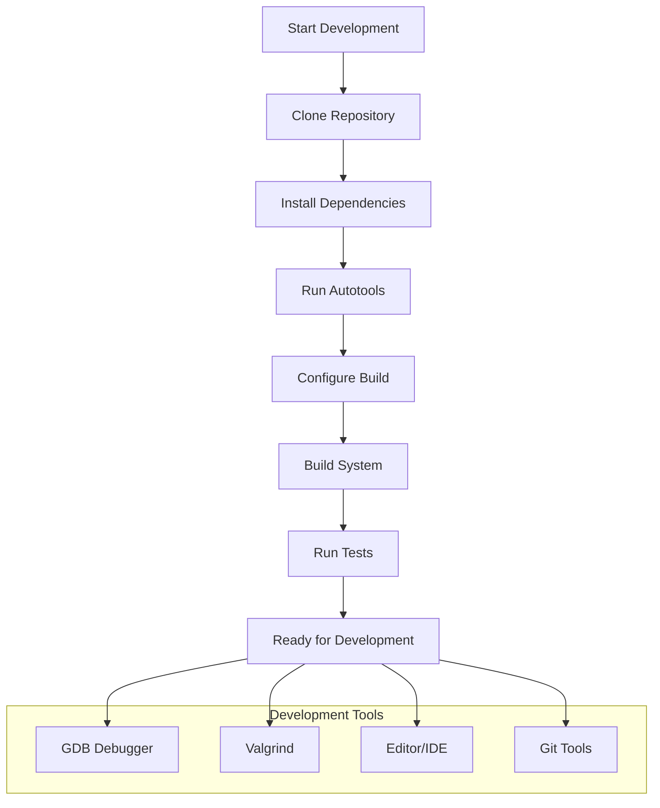
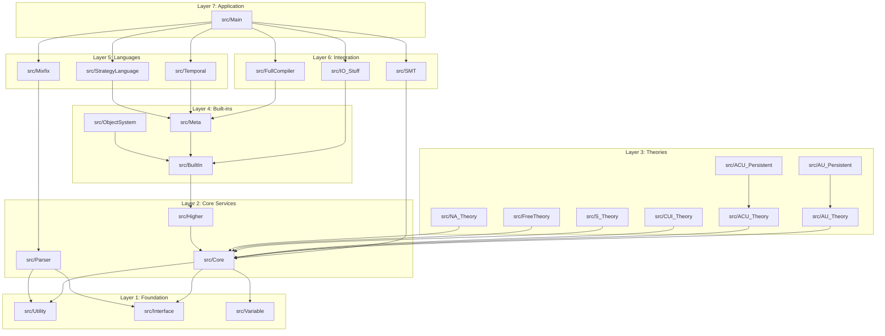
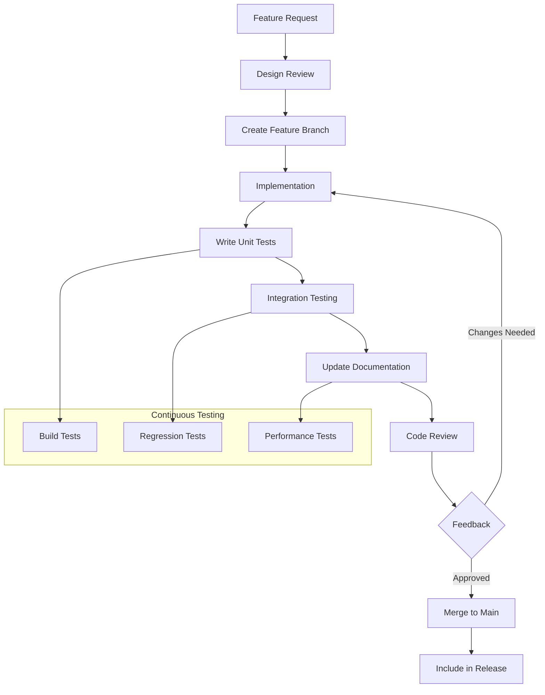
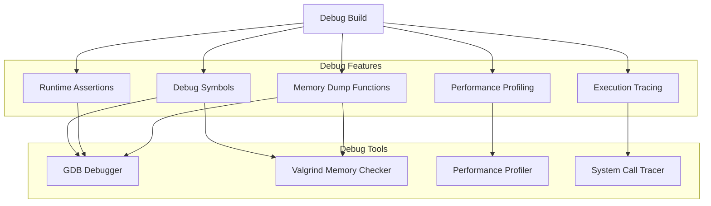
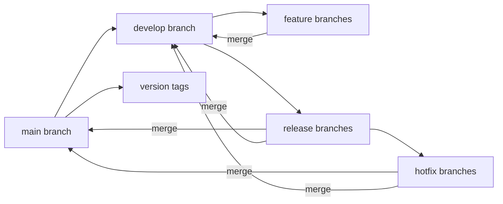

# Maude Development Workflow and Architecture

## Development Environment Setup

### Quick Start Development Setup



### Prerequisites Installation

```bash
# Ubuntu/Debian
sudo apt-get update
sudo apt-get install -y \
    build-essential \
    autotools-dev \
    automake \
    autoconf \
    libtool \
    bison \
    flex \
    libgmp-dev \
    libgmpxx4ldbl \
    libsigsegv-dev \
    libtecla-dev \
    libbdd-dev \
    git \
    valgrind \
    gdb

# Optional: SMT solvers
sudo apt-get install -y libyices2-dev libcvc4-dev

# macOS with Homebrew
brew install autoconf automake libtool bison flex gmp libsigsegv tecla buddy git

# Optional: SMT solvers  
brew install yices2 cvc4
```

### Development Build Configuration

```bash
# Development configuration
./configure \
    --enable-debug \
    --with-tecla \
    --with-libsigsegv \
    --with-yices2 \
    CXXFLAGS="-g -O0 -Wall -Wextra -DDEBUG" \
    CFLAGS="-g -O0 -Wall -Wextra"

# Alternative: Release with debug symbols
./configure \
    --with-tecla \
    --with-libsigsegv \
    --with-yices2 \
    CXXFLAGS="-g -O2 -DNDEBUG" \
    CFLAGS="-g -O2 -DNDEBUG"
```

## Code Organization and Architecture

### Source Code Structure



### Key Design Patterns

#### 1. Visitor Pattern (Term Processing)
```cpp
class TermVisitor {
public:
    virtual void visitTerm(Term* term) = 0;
    virtual void visitDagNode(DagNode* dagNode) = 0;
    virtual void visitSymbol(Symbol* symbol) = 0;
};

// Usage in various algorithms
class RewriteVisitor : public TermVisitor {
    void visitDagNode(DagNode* dagNode) override {
        // Perform rewriting on dagNode
    }
};
```

#### 2. Strategy Pattern (Theory Selection)
```cpp
class TheoryStrategy {
public:
    virtual bool unify(DagNode* pattern, DagNode* subject) = 0;
    virtual bool match(DagNode* pattern, DagNode* subject) = 0;
};

class ACU_TheoryStrategy : public TheoryStrategy { /* ... */ };
class AU_TheoryStrategy : public TheoryStrategy { /* ... */ };
```

#### 3. Template Metaprogramming (Collections)
```cpp
template<typename T>
class Vector {
    // Efficient dynamic arrays with template specializations
};

template<typename Key, typename Value>
class HashConsSet {
    // Hash consing for structural sharing
};
```

## Development Workflow

### Feature Development Process



### Git Workflow

```bash
# 1. Create feature branch
git checkout -b feature/new-theory-support

# 2. Make changes with atomic commits  
git add src/NewTheory/
git commit -m "Add: Core NewTheory symbol implementation

- Implement NewTheorySymbol class
- Add basic unification algorithm  
- Include initial test cases"

# 3. Keep branch updated
git fetch origin
git rebase origin/main

# 4. Push and create pull request
git push origin feature/new-theory-support
```

### Testing Strategy

#### Unit Testing Structure
```
tests/
├── Corner/              # Edge cases and corner conditions
├── BuiltIn/            # Built-in type tests
├── Meta/               # Meta-level operation tests  
├── Misc/               # General functionality tests
├── ObjectOriented/     # Object system tests
├── ResolvedBugs/       # Regression tests for fixed bugs
└── StrategyLanguage/   # Strategy language tests
```

#### Test Development Pattern
```bash
# 1. Write failing test first
echo "Testing new feature..." > tests/Misc/new-feature.maude
echo "Expected output" > tests/Misc/new-feature.expected

# 2. Run test to confirm failure
cd tests && make check

# 3. Implement feature until test passes
# 4. Add additional edge case tests
```

#### Automated Testing Commands
```bash
# Run all tests
make check

# Run specific test category
make check-Corner
make check-BuiltIn
make check-Meta

# Run single test
cd tests/Misc && maude < test-file.maude > output.txt

# Performance testing
make check TESTSUITEFLAGS="--performance"

# Memory leak testing
make check TESTSUITEFLAGS="--valgrind"
```

## Debugging Architecture

### Debug Build Configuration



### Common Debugging Scenarios

#### 1. Segmentation Fault Debugging
```bash
# Build with debug symbols
./configure --enable-debug
make clean && make

# Run with gdb
gdb ./src/Main/maude
(gdb) set args test-file.maude
(gdb) run
# ... crash occurs
(gdb) bt
(gdb) info locals
(gdb) print variable_name
```

#### 2. Memory Leak Detection
```bash
# Run with valgrind
valgrind --leak-check=full --track-origins=yes \
    ./src/Main/maude test-file.maude

# Advanced memory debugging
valgrind --tool=helgrind ./src/Main/maude test-file.maude
```

#### 3. Performance Profiling
```bash
# CPU profiling
perf record -g ./src/Main/maude large-computation.maude
perf report

# Memory profiling
valgrind --tool=massif ./src/Main/maude large-computation.maude
ms_print massif.out.pid
```

### Debug Macros and Instrumentation

```cpp
// Debug assertions (enabled in debug builds)
#ifndef NO_ASSERT
#define Assert(condition, message) \
    do { if (!(condition)) { \
        cerr << "Assertion failed: " << message << " at " \
             << __FILE__ << ":" << __LINE__ << endl; \
        abort(); \
    } } while(0)
#else
#define Assert(condition, message)
#endif

// Debug output
#ifdef DUMP
#define DebugInfo(x) \
    do { cout << "DEBUG: " << x << endl; } while(0)
#else  
#define DebugInfo(x)
#endif

// Performance timing
#ifdef PROFILE
#define PROFILE_START(name) \
    auto start_##name = std::chrono::high_resolution_clock::now()
#define PROFILE_END(name) \
    auto end_##name = std::chrono::high_resolution_clock::now(); \
    auto duration_##name = std::chrono::duration_cast<std::chrono::microseconds>( \
        end_##name - start_##name); \
    cout << #name << " took " << duration_##name.count() << " microseconds" << endl
#else
#define PROFILE_START(name)
#define PROFILE_END(name)
#endif
```

## Code Style and Standards

### C++ Coding Standards

#### Naming Conventions
```cpp
// Classes: PascalCase
class DagNode;
class RewritingContext;

// Functions: camelCase
void insertSymbol(Symbol* symbol);
bool canRewrite(DagNode* node);

// Variables: camelCase
int nrArgs;
Symbol* topSymbol;

// Constants: UPPER_CASE
const int MAX_ARITY = 256;
const char* PRELUDE_FILE = "prelude.maude";

// Private members: leading underscore (optional)
class MyClass {
private:
    int _internalCounter;
    Vector<Symbol*> _symbols;
};
```

#### Header File Structure
```cpp
#ifndef MY_HEADER_HH
#define MY_HEADER_HH

//
//  Class MyClass.
//
class MyClass 
{
public:
    // Constructor/Destructor
    MyClass();
    ~MyClass();
    
    // Public interface
    void publicMethod();
    int getProperty() const;
    
private:
    // Private implementation
    void privateMethod();
    
    // Member variables
    int property;
    Vector<int> data;
};

#endif // MY_HEADER_HH
```

#### Implementation File Structure
```cpp
//
//  Implementation for MyClass.
//
#include "myHeader.hh"

MyClass::MyClass()
: property(0)
{
    // Constructor implementation
}

void 
MyClass::publicMethod()
{
    // Method implementation with clear spacing
    if (condition)
    {
        // Indented block
        doSomething();
    }
}
```

### Documentation Standards

#### Function Documentation
```cpp
//
//  Brief description of the function.
//  
//  Detailed description explaining the purpose,
//  parameters, return value, and any side effects.
//
//  @param parameter1 Description of first parameter
//  @param parameter2 Description of second parameter  
//  @return Description of return value
//  @throws ExceptionType Description of when exception is thrown
//
ReturnType functionName(ParamType1 parameter1, ParamType2 parameter2);
```

#### Class Documentation
```cpp
//
//  Class representing a computational entity in the rewriting system.
//
//  This class encapsulates the core functionality for term representation
//  and manipulation within the Maude rewriting engine. It provides
//  interfaces for pattern matching, unification, and rewriting operations.
//
//  Key responsibilities:
//  - Term structure management
//  - Symbol table integration  
//  - Memory management via hash consing
//  - Theory-specific algorithm dispatch
//
class CoreEntity
{
    // ... class definition
};
```

## Performance Optimization Guidelines

### Memory Optimization Patterns

#### 1. Hash Consing
```cpp
// Ensure structural sharing of identical terms
class HashConsSet {
private:
    HashMap<Term*, DagNode*> hashTable;
    
public:
    DagNode* insert(Term* term) {
        auto existing = hashTable.find(term);
        if (existing != hashTable.end()) {
            // Reuse existing node
            return existing->second;
        }
        // Create new node
        DagNode* newNode = new DagNode(term);
        hashTable[term] = newNode;
        return newNode;
    }
};
```

#### 2. Memory Pools
```cpp
// Use memory pools for frequently allocated objects
template<typename T>
class MemoryPool {
private:
    Vector<T*> freeList;
    Vector<T*> allocatedBlocks;
    
public:
    T* allocate() {
        if (freeList.empty()) {
            expandPool();
        }
        T* result = freeList.back();
        freeList.pop_back();
        return result;
    }
    
    void deallocate(T* object) {
        freeList.push_back(object);
    }
};
```

### Algorithmic Optimization

#### 1. Memoization
```cpp
// Cache expensive computation results
class MemoTable {
private:
    HashMap<pair<DagNode*, DagNode*>, bool> unificationCache;
    
public:
    bool unify(DagNode* pattern, DagNode* subject) {
        auto key = make_pair(pattern, subject);
        auto cached = unificationCache.find(key);
        if (cached != unificationCache.end()) {
            return cached->second;
        }
        
        bool result = computeUnification(pattern, subject);
        unificationCache[key] = result;
        return result;
    }
};
```

#### 2. Early Termination
```cpp
// Fail fast on impossible cases
bool quickUnificationCheck(DagNode* pattern, DagNode* subject) {
    // Quick symbol compatibility check
    if (pattern->symbol() != subject->symbol()) {
        return false;
    }
    
    // Quick arity check
    if (pattern->nrArgs() != subject->nrArgs()) {
        return false;
    }
    
    // Quick sort check
    if (!pattern->getSort()->leq(subject->getSort())) {
        return false;
    }
    
    return true; // Proceed with full unification
}
```

## Release Management

### Version Control Strategy



### Release Process

```bash
# 1. Prepare release branch
git checkout develop
git pull origin develop
git checkout -b release/3.6

# 2. Update version numbers
sed -i 's/3.5/3.6/g' configure.ac
git commit -am "Bump version to 3.6"

# 3. Final testing
make distcheck
make check

# 4. Create release
git checkout main
git merge release/3.6
git tag -a v3.6 -m "Maude version 3.6"
git push origin main --tags

# 5. Back-merge to develop
git checkout develop  
git merge main
git push origin develop

# 6. Clean up
git branch -d release/3.6
```

## Contributing Guidelines

### Pull Request Process

1. **Fork and Clone**: Fork the repository and clone your fork
2. **Branch**: Create a feature branch from `main`
3. **Implement**: Make changes following coding standards
4. **Test**: Ensure all tests pass and add new tests
5. **Document**: Update documentation as needed
6. **Review**: Submit pull request for code review
7. **Iterate**: Address feedback and update as needed
8. **Merge**: Maintainer merges after approval

### Code Review Checklist

- [ ] **Functionality**: Does the code solve the intended problem?
- [ ] **Testing**: Are there adequate tests for new functionality?
- [ ] **Performance**: Does the code maintain performance standards?
- [ ] **Style**: Does the code follow established style guidelines?
- [ ] **Documentation**: Is the code and API properly documented?
- [ ] **Compatibility**: Does the change maintain backward compatibility?
- [ ] **Security**: Are there any security implications?

---

This development workflow provides a comprehensive framework for contributing to and maintaining the Maude codebase effectively.