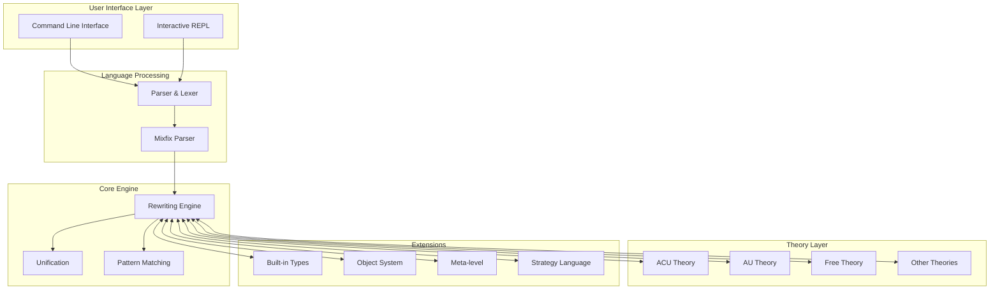

# Maude Technical Documentation Index

This directory contains comprehensive technical documentation for the Maude system, including architecture overviews, API references, deployment guides, and development workflows.

## 📋 Documentation Overview

### Core Architecture Documentation

| Document | Description | Audience |
|----------|-------------|----------|
| **[TECHNICAL_ARCHITECTURE.md](TECHNICAL_ARCHITECTURE.md)** | Complete system architecture with Mermaid diagrams | Developers, Architects |
| **[API_INTERFACES.md](API_INTERFACES.md)** | Detailed API and interface documentation | Developers, Integrators |
| **[DEPLOYMENT_ARCHITECTURE.md](DEPLOYMENT_ARCHITECTURE.md)** | Installation, configuration, and deployment | DevOps, System Admins |
| **[DEVELOPMENT_WORKFLOW.md](DEVELOPMENT_WORKFLOW.md)** | Development practices and contribution guide | Contributors, Maintainers |

## 🏗️ System Architecture Overview

The Maude system follows a layered architecture with clear separation of concerns:

## 📚 Document Descriptions

### 1. Technical Architecture (TECHNICAL_ARCHITECTURE.md)

**Purpose**: Comprehensive system architecture documentation with visual diagrams

**Contents**:
- System overview and design principles
- Module dependency architecture
- Data flow diagrams
- Build system architecture
- Core component descriptions
- Memory management strategies
- Performance considerations

**Key Diagrams**:
- System Architecture Diagram
- Module Dependencies Graph
- Data Flow Architecture
- Build System Architecture

### 2. API and Interfaces (API_INTERFACES.md)

**Purpose**: Detailed programming interfaces and extension points

**Contents**:
- Core interfaces (Term, Module, RewritingContext)
- Theory-specific APIs (ACU, AU, Free, etc.)
- Built-in type interfaces
- Parser and Mixfix APIs
- Meta-level programming interfaces
- Strategy language APIs
- SMT integration interfaces
- I/O and external system interfaces

**Key Features**:
- Class diagrams for major interfaces
- Extension point documentation
- Thread safety considerations
- Performance optimization guidelines

### 3. Deployment Architecture (DEPLOYMENT_ARCHITECTURE.md)

**Purpose**: Installation, configuration, and operational deployment

**Contents**:
- System requirements and dependencies
- Build configuration options
- Installation layouts
- Runtime environment setup
- Package management integration
- Performance tuning guidelines
- Monitoring and diagnostics
- Security considerations

**Key Features**:
- Dependency architecture diagrams
- Build process flow charts
- Deployment scenario comparisons
- Containerization examples

### 4. Development Workflow (DEVELOPMENT_WORKFLOW.md)

**Purpose**: Development practices, coding standards, and contribution guidelines

**Contents**:
- Development environment setup
- Code organization and design patterns
- Testing strategies
- Debugging techniques
- Code style and standards
- Performance optimization patterns
- Release management process
- Contribution guidelines

**Key Features**:
- Development workflow diagrams
- Code organization architecture
- Debugging architecture
- Git workflow illustrations

## 🔗 Related Documentation

### External References
- **[Maude Manual](https://maude.cs.illinois.edu/manual.pdf)** - Official user manual
- **[Maude Website](https://maude.cs.illinois.edu)** - Project homepage
- **[GitHub Repository](https://github.com/maude-lang/Maude)** - Source code

### Historical Documentation
The `alpha*.txt` files contain detailed release notes for development versions:
- `alpha132.txt` through `alpha163.txt` - Chronological development history
- Focus on bug fixes, feature additions, and breaking changes

## 🚀 Quick Start Guides

### For Users
1. See [DEPLOYMENT_ARCHITECTURE.md](DEPLOYMENT_ARCHITECTURE.md) for installation
2. Refer to the official Maude manual for language usage
3. Check the `src/Main/` directory for built-in modules

### For Developers  
1. Follow [DEVELOPMENT_WORKFLOW.md](DEVELOPMENT_WORKFLOW.md) for environment setup
2. Review [TECHNICAL_ARCHITECTURE.md](TECHNICAL_ARCHITECTURE.md) for system understanding
3. Consult [API_INTERFACES.md](API_INTERFACES.md) for programming interfaces

### For System Administrators
1. See [DEPLOYMENT_ARCHITECTURE.md](DEPLOYMENT_ARCHITECTURE.md) for deployment options
2. Review performance tuning and monitoring sections
3. Check security considerations for production deployments

## 📈 Architecture Evolution

The Maude system has evolved through several architectural phases:

### Current Architecture (v3.5+)
- Modular C++ design with clean layer separation
- Comprehensive theory support (ACU, AU, CUI, Free, etc.)
- Integrated SMT solver support
- Object-oriented programming features
- Strategy language for controlled rewriting
- Meta-level reflection capabilities

### Future Considerations
- Parallelization for multi-core performance
- Modern C++ standards adoption
- Enhanced plugin architecture
- Improved memory management
- Extended SMT integration

## 🛠️ Maintenance and Updates

This documentation is maintained alongside the codebase:

- **Version Control**: All documentation is version-controlled with the source
- **Updates**: Documentation updates should accompany relevant code changes
- **Reviews**: Documentation changes follow the same review process as code
- **Format**: Markdown with Mermaid diagrams for accessibility and maintainability

## 📞 Support and Community

- **Bug Reports**: [GitHub Issues](https://github.com/maude-lang/Maude/issues)
- **Mailing Lists**: 
  - Help: maude-help@maude.cs.uiuc.edu
  - Bugs: maude-bugs@maude.cs.uiuc.edu
- **Development**: Follow development workflow for contributions

---

*This documentation provides a comprehensive technical reference for the Maude system. For specific implementation details, refer to the individual documents and source code.*