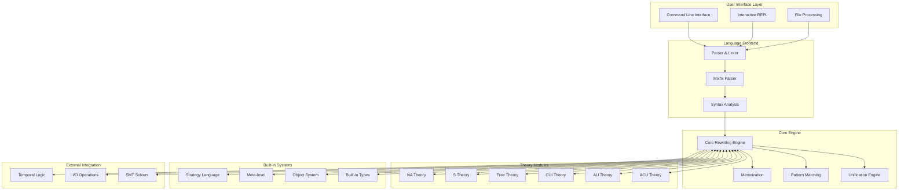
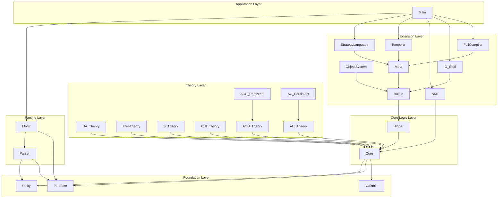
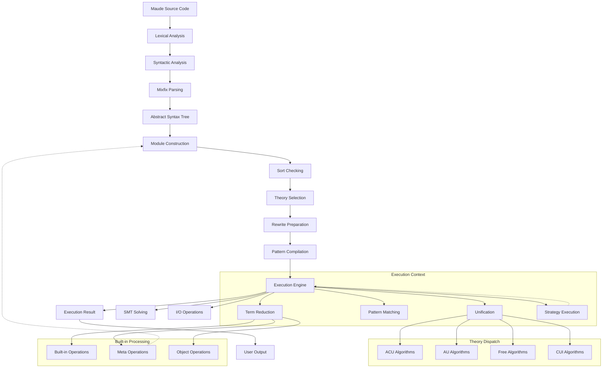
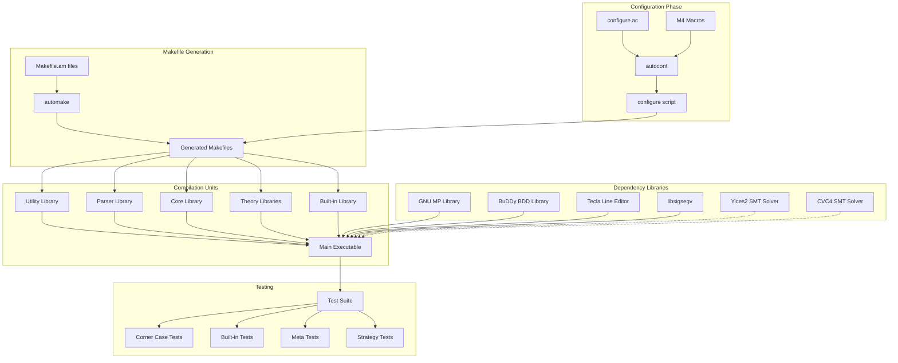

# Maude Technical Architecture Documentation

## Overview

Maude is a high-performance reflective language and system supporting both equational and rewriting logic specification and programming. This document provides a comprehensive technical architecture overview of the Maude interpreter, including system components, data flows, and architectural patterns.

## System Architecture

Maude is implemented as a modular C++ system with clear separation of concerns across multiple subsystems. The architecture follows a layered approach with core rewriting logic at the center, surrounded by parsing, built-in theories, and user interface layers.

## Module Dependencies

The Maude system is organized into 25 distinct modules, each with specific responsibilities and dependencies:

## Data Flow Architecture

The data flow in Maude follows a clear pipeline from source code to execution:

## Build System Architecture

Maude uses GNU Autotools for its build system, providing portability across Unix-like systems:

## Core Components

### 1. Utility Layer
- **Location**: `src/Utility/`
- **Purpose**: Fundamental data structures, memory management, and utility functions
- **Key Features**: Vector templates, memory allocation, basic algorithms

### 2. Interface Layer  
- **Location**: `src/Interface/`
- **Purpose**: Core interfaces and abstract base classes
- **Key Features**: Term interfaces, symbol definitions, sort hierarchies

### 3. Parser Subsystem
- **Location**: `src/Parser/`
- **Purpose**: Lexical and syntactic analysis of Maude source code
- **Key Features**: Flex/Bison based parsing, mixfix operator handling

### 4. Core Engine
- **Location**: `src/Core/`
- **Purpose**: Central rewriting logic engine
- **Key Features**: 
  - Pattern matching and unification
  - Term rewriting
  - Strategy execution
  - Memory management for terms
  - Module system

### 5. Variable Management
- **Location**: `src/Variable/`
- **Purpose**: Variable binding and substitution management
- **Key Features**: Variable abstraction, substitution composition

### 6. Theory Modules
Each theory provides specialized algorithms for specific algebraic structures:

- **ACU Theory** (`src/ACU_Theory/`, `src/ACU_Persistent/`): Associative-Commutative-Unity
- **AU Theory** (`src/AU_Theory/`, `src/AU_Persistent/`): Associative-Unity  
- **CUI Theory** (`src/CUI_Theory/`): Commutative-Unity-Idempotent
- **Free Theory** (`src/FreeTheory/`): Free algebra
- **S Theory** (`src/S_Theory/`): Special theory handling
- **NA Theory** (`src/NA_Theory/`): Non-associative theory

### 7. Built-in Systems
- **Built-in Types** (`src/BuiltIn/`): Integers, strings, floating point, etc.
- **Object System** (`src/ObjectSystem/`): Object-oriented programming support  
- **Meta Level** (`src/Meta/`): Reflection and meta-programming
- **Strategy Language** (`src/StrategyLanguage/`): Strategy definition and execution

### 8. External Integration
- **SMT Integration** (`src/SMT/`): Interface to SMT solvers (Yices2, CVC4)
- **I/O Operations** (`src/IO_Stuff/`): File and network I/O
- **Temporal Logic** (`src/Temporal/`): Temporal logic model checking

### 9. Advanced Features
- **Full Compiler** (`src/FullCompiler/`): Experimental compilation features
- **Mixfix Parser** (`src/Mixfix/`): Advanced operator parsing
- **Higher Level** (`src/Higher/`): Higher-order features

## Memory Management

Maude implements sophisticated memory management for term structures:

- **Hash Consing**: Ensures structural sharing of identical subterms
- **Garbage Collection**: Automatic memory reclamation for unreachable terms  
- **Memoization**: Caches computation results for performance
- **Copy-on-Write**: Efficient term copying through delayed copying

## Concurrency and Performance

- **Single-threaded Design**: Current implementation is single-threaded
- **Optimized Data Structures**: Carefully tuned for rewriting performance
- **Theory-specific Algorithms**: Specialized algorithms for each algebraic theory
- **Lazy Evaluation**: Deferred computation where beneficial

## Extension Points

The architecture provides several extension mechanisms:

1. **New Theories**: Add support for additional algebraic theories
2. **Built-in Types**: Extend with new built-in data types  
3. **SMT Solvers**: Interface to additional SMT solvers
4. **I/O Modules**: Add new I/O capabilities
5. **Strategy Language**: Extend strategy language features

## Configuration and Portability

The build system supports extensive configuration:

- **Optional Dependencies**: SMT solvers, line editing, signal handling
- **Compiler Optimization**: Platform-specific optimization flags
- **Debug Support**: Configurable debug and profiling support
- **Cross-platform**: Supports multiple Unix-like operating systems

## Future Architecture Considerations

Potential architectural improvements:

1. **Parallelization**: Multi-threaded execution for independent computations
2. **Modularization**: Further separation of concerns
3. **Plugin Architecture**: Dynamic loading of extensions  
4. **Modern C++**: Migration to newer C++ standards
5. **Memory Optimization**: Reduced memory footprint for large computations

---

This architecture provides a solid foundation for a high-performance rewriting logic system while maintaining modularity and extensibility for future enhancements.